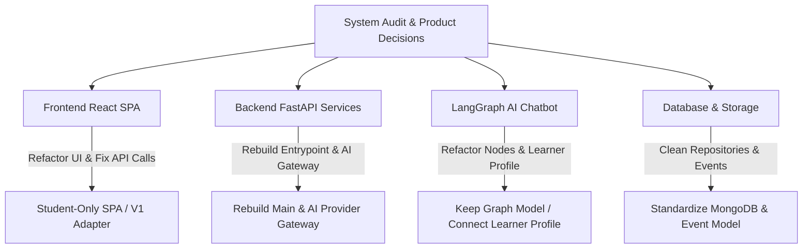

# 00 - Executive Summary

## Overview

This document presents an evidence-based codebase discovery and audit of the **Mello.ai (Learning-Potato)** platform repository located at `/home/manika/Documents/Projects/Learning-Platform/learning-potato`. 

The platform is designed to support children through an adaptive, agentic AI chatbot built using **LangGraph**, **LangChain**, and **ChatGroq**, alongside a React frontend dashboard for educational metrics, homework assistance, and quiz generation.

> [!IMPORTANT]
> **Audit Directive Compliance**: No project source code, configuration files, dependencies, routes, or database schemas were modified during this audit. All findings are derived directly from static inspection and repository evidence.

---

## Confirmed Product Direction

Following the initial audit, five authoritative product decisions were confirmed by the product owner to guide the V1 rebuild architecture:

1. **Student-Only Platform Scope (V1)**: The initial rebuild will support students only. Parent, educator, and admin portals are out of scope for V1. Reusable authorization policies will ensure future role extensibility.
2. **Platform-Wide Adaptive Learning**: Adaptivity extends beyond chatbot tone to control the entire platform (explanations, hints, quiz difficulty, homework help, dashboard insights, roadmap pace) via a structured multidimensional **Learner Profile**.
3. **Deferred Moderation**: Input/output moderation, safety classification, and crisis escalation workflows are deferred from V1 but remain required prior to unrestricted public release. Architectural policy extension points will be established.
4. **Task-Based AI Gateway Strategy**: No single permanent AI provider is locked. Access will be standardized through an internal AI Gateway interface (`LLMProvider`) supporting task-specific provider adapters (e.g. Groq, Gemini, OpenAI).
5. **Database Persistence Strategy**: Most application data will be stored in the database. MongoDB remains the recommended primary database for the V1 rebuild, utilizing a standardized repository layer and learning event stream.

Detailed decision records are documented in [22 - Confirmed Product Decisions](22-confirmed-product-decisions.md).

---

## Key Audit Findings Summary

| Audit Area | Findings & Findings Summary | Evidence / References |
| :--- | :--- | :--- |
| **Backend System** | `CRITICAL`: Backend entrypoint `app/main.py` is `MISSING` (`deleted` in git working tree). FastAPI application is never instantiated, routers are never included, and Docker deployment fails. | [Dockerfile](file:///home/manika/Documents/Projects/Learning-Platform/learning-potato/ai-learning-backend/Dockerfile#L13) |
| **LangGraph Chatbot** | `PARTIALLY IMPLEMENTED`: A 9-node LangGraph `StateGraph` exists in `agent_chatbot.py`. However, invoking `/chatbot/chat` triggers a server crash (`NameError: name 'deepcopy' is not defined`), and session storage uses mismatched MongoDB collections (`chat_collection` vs `chat_sessions`). | [agent_chatbot.py](file:///home/manika/Documents/Projects/Learning-Platform/learning-potato/ai-learning-backend/app/services/chatbot/agent_chatbot.py#L328-L360), [chatbot.py](file:///home/manika/Documents/Projects/Learning-Platform/learning-potato/ai-learning-backend/app/router/chatbot.py#L53-L128) |
| **Adaptive Learning** | `INFERRED / PROTOTYPE`: Current adaptivity is restricted to estimating an "intellectual age" via a 5-question prompt sequence. True dynamic curriculum recommendation or performance-based adaptation is `MISSING`. | [agent_chatbot.py](file:///home/manika/Documents/Projects/Learning-Platform/learning-potato/ai-learning-backend/app/services/chatbot/agent_chatbot.py#L142-L181) |
| **AI Safety & Child Protection** | `RISK / DEFERRED`: No safety guardrails, moderation layers, prompt injection defenses, input sanitization, or parental consent controls exist in code. Moderation is deferred for V1 but requires extension points. | [agent_chatbot.py](file:///home/manika/Documents/Projects/Learning-Platform/learning-potato/ai-learning-backend/app/services/chatbot/agent_chatbot.py#L255-L287) |
| **Database Architecture** | `CONFLICT`: Code is in a half-migrated state between SQLAlchemy/SQLite (obsolete models in `app/models.py`) and Motor/MongoDB async driver (`app/mongo_db.py`). | [models.py](file:///home/manika/Documents/Projects/Learning-Platform/learning-potato/ai-learning-backend/app/models.py#L1-L21), [mongo_db.py](file:///home/manika/Documents/Projects/Learning-Platform/learning-potato/ai-learning-backend/app/mongo_db.py#L8-L39) |
| **Frontend - Backend API** | `CONFLICT`: Frontend API client (`api.js`) passes object headers into string parameters, causing HTTP authorization header corruption (`Authorization: Bearer [object Object]`). Quiz page uses hardcoded mock data. | [api.js](file:///home/manika/Documents/Projects/Learning-Platform/learning-potato/ai-learning-frontend/src/api/api.js#L223-L235), [Quiz.jsx](file:///home/manika/Documents/Projects/Learning-Platform/learning-potato/ai-learning-frontend/src/pages/Quiz.jsx#L63-L86) |
| **Testing & Quality** | `MISSING`: Backend `test.py` is a database table dropping script, not a test suite. Frontend has no test script declared in `package.json`. | [test.py](file:///home/manika/Documents/Projects/Learning-Platform/learning-potato/ai-learning-backend/test.py#L4-L5), [package.json](file:///home/manika/Documents/Projects/Learning-Platform/learning-potato/ai-learning-frontend/package.json#L6-L11) |

---

## Classification of Subsystem Rebuild Readiness

- **Preserve after repair**: Frontend UI layout (Tailwind + React components), LangGraph StateGraph flow logic in `agent_chatbot.py`.
- **Refactor before reuse**: Backend router authorization & exception handling, Dashboard data aggregation services, Homework image OCR pipeline.
- **Replace / Rebuild entirely**: Backend main application entrypoint (`app/main.py`), API client parameter contracts (`src/api/api.js`), Rate limiter wrapper, AI Provider abstraction, Database repository pattern.
