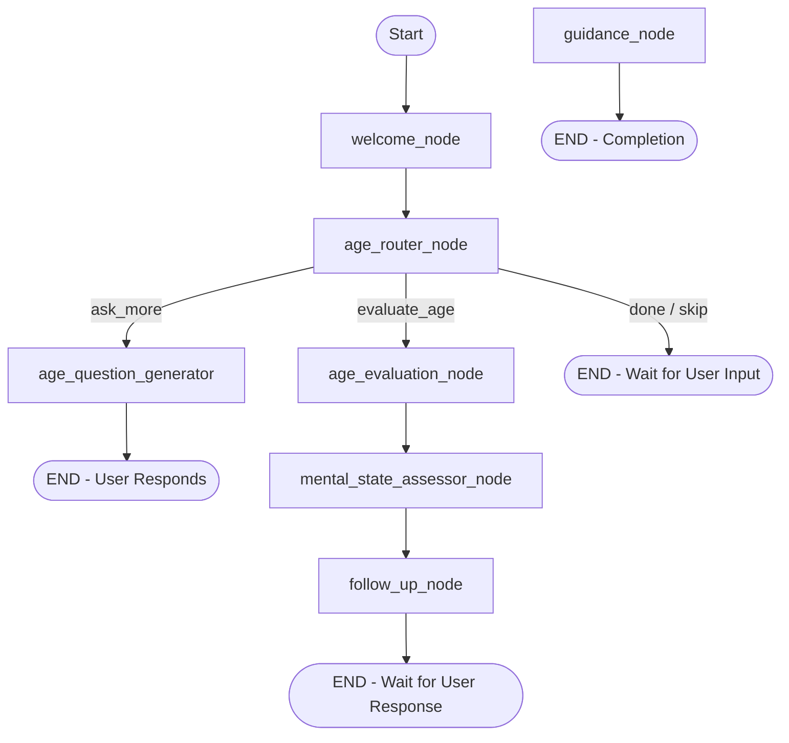

# 07 - LangGraph & Agentic Chatbot Audit

## Overview & Graph Architecture

The core AI engine is implemented in `app/services/chatbot/agent_chatbot.py` using **LangGraph 0.6.4** `StateGraph`. The current implementation uses an in-memory `MemorySaver` checkpointer and calls `ChatGroq` (`llama-3.1-8b-instant`).



---

## State Schema Documentation (Current Implementation)

The state is defined as a TypedDict `State` in `agent_chatbot.py`:

```python
class State(TypedDict):
    username: str
    user_input: str
    conversation_history: list
    
    # Age assessment fields
    estimated_age: int  
    age_category: str  
    age_confidence: int 
    age_indicators: list  
    age_questions_asked: int
    age_answers: list
        
    # Mental state fields
    assessment_score: int  
    primary_concern: str  
    emotional_state: str
    risk_level: str  
    
    # Response fields
    current_response: str
    needs_more_info: bool
    final_guidance: str

    # checks
    age_assessment_complete: bool
    mental_assessment_complete: bool
    follow_up_done: bool

    # flags
    router_flag: Literal["age_question_generator", "mental_state_assessor", "follow_up", "guidance"]
    age_router_flag: Literal["ask_more", "evaluate_age", "skip"]
```

---

## State Field Trace & Risk Table

| State Field | Type | Set By Node | Read By Node | Persistence | Risk / Finding |
| :--- | :--- | :--- | :--- | :--- | :--- |
| `username` | `str` | None | None | MongoDB `state` | `UNUSED`: Field declared in State schema but never populated or read by any node. |
| `user_input` | `str` | External / Router | `age_ans_node, chat_service_node` | MongoDB `state` | `VERIFIED`: Updated before graph execution. |
| `conversation_history` | `list` | `welcome_node, age_question_generator, age_ans_node, age_evaluation, follow_up, guidance` | `mental_state_assessor_node, guidance_node` | MongoDB `state` | `VERIFIED`: Appends messages with role and content. |
| `estimated_age` | `int` | `age_evaluation_node` | `mental_state_assessor_node, follow_up_node, guidance_node` | MongoDB `state` | `VERIFIED`: Set from LLM JSON evaluation. |
| `age_category` | `str` | `age_evaluation_node` | `mental_state_assessor_node, follow_up_node, guidance_node` | MongoDB `state` | `VERIFIED`: Categorized as `child/teen/young_adult/adult`. |
| `age_confidence` | `int` | `age_evaluation_node` | None | MongoDB `state` | `UNUSED`: Stored in state but never read by downstream nodes. |
| `age_indicators` | `list` | `welcome_node, age_evaluation_node` | None | MongoDB `state` | `UNUSED`: Stored in state but never read by downstream nodes. |
| `age_questions_asked` | `int` | `age_ans_node` | `age_question_generator, age_router_node` | MongoDB `state` | `VERIFIED`: Incremented per answer. |
| `age_answers` | `list` | `age_ans_node` | `age_question_generator, age_evaluation_node` | MongoDB `state` | `VERIFIED`: Stores user answer strings. |
| `assessment_score` | `int` | `mental_state_assessor_node` | `guidance_node` | MongoDB `state` | `VERIFIED`: Parsed from urgency score string [1-10]. |
| `primary_concern` | `str` | `mental_state_assessor_node` | `follow_up_node, guidance_node` | MongoDB `state` | `VERIFIED`: Parsed from string matching. |
| `emotional_state` | `str` | `mental_state_assessor_node` | `guidance_node` | MongoDB `state` | `VERIFIED`: Parsed from string matching. |
| `risk_level` | `str` | `mental_state_assessor_node` | `guidance_node` | MongoDB `state` | `VERIFIED`: Parsed as `low/medium/high`. |
| `current_response` | `str` | `age_question_generator, age_evaluation, follow_up, guidance` | Router / API response | MongoDB `state` | `VERIFIED`: Returned to client. |
| `needs_more_info` | `bool` | `welcome_node` | None | MongoDB `state` | `UNUSED`: Set to True in welcome_node but never checked in edges. |
| `final_guidance` | `str` | `guidance_node` | Router | MongoDB `state` | `VERIFIED`: Populated upon graph completion. |
| `age_assessment_complete` | `bool` | `age_evaluation_node` | `age_router_node` | MongoDB `state` | `VERIFIED`: Gates age routing. |
| `mental_assessment_complete` | `bool` | `mental_state_assessor_node` | `router_node` | MongoDB `state` | `VERIFIED`: Gates mental state routing. |
| `follow_up_done` | `bool` | `follow_up_node` | `router_node` | MongoDB `state` | `VERIFIED`: Gates follow-up routing. |

---

## Target Rebuild Recommendations for LangGraph System

Based on confirmed product decisions (Decisions 2, 4, and 5):

1. **Split Monolithic Graph File into Modules**: Move node functions into dedicated module files (`nodes/assessment.py`, `nodes/tutoring.py`, `nodes/recalibration.py`) rather than keeping all 532 lines in a single script.
2. **Integrate Structured Learner Profile**: Replace single `estimated_age` state fields with the multidimensional `LearnerProfile` object. The graph should inject the student's active cognitive and academic profile dimensions into the graph state prior to execution.
3. **Invoke Internal AI Gateway**: Remove direct `ChatGroq` or SDK instantiations inside node functions. Nodes must call the internal `AI Gateway` (`LLMProvider.generate(...)`), ensuring model-agnostic execution.
4. **Enforce Structured Pydantic Outputs**: Use Pydantic schemas for LLM responses (`with_structured_output(...)`) to eliminate manual string-parsing regex loops (such as parsing `Urgency Score:` lines).
5. **Separate Assessment State from Chat History**: Maintain dedicated state sub-graphs for initial cognitive/academic assessment vs general tutoring interactions.
6. **Emit Learning Events**: Node completions should publish structured `LearningEvents` (e.g. `CHAT_INTERACTION_COMPLETED`) to trigger profile recalibration outside the graph execution loop.
7. **MongoDB Checkpointer**: Replace `MemorySaver` in-memory checkpointer with a custom MongoDB `AsyncMongoDBSaver` to ensure graph checkpoints survive server restarts.
