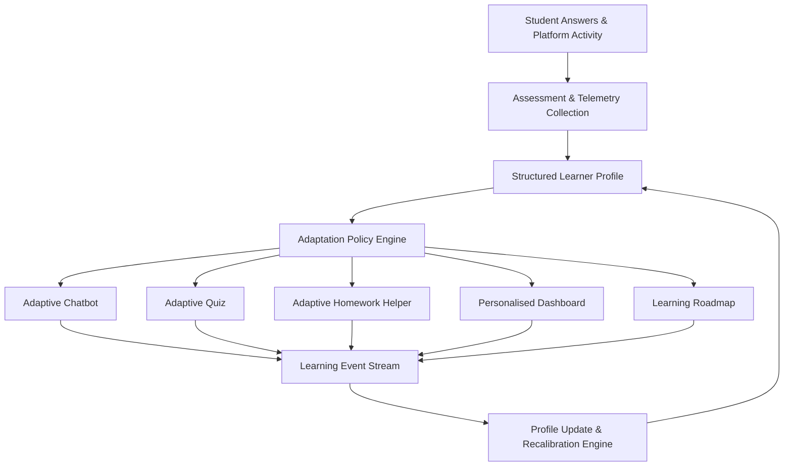

# 08 - Adaptive Learning Behavior Audit & Target Design

## Overview & Confirmed Product Definition

Adaptive learning is authoritatively defined for the platform rebuild as:
> **The system begins by evaluating the student through their answers, infers their mental and cognitive capabilities, and adapts the complete platform according to that learner profile.**

> [!IMPORTANT]
> **Audit Finding Notice**: The current implementation does **not** yet provide platform-wide adaptivity. The age-estimation sequence in `agent_chatbot.py` is an early prototype signal that performs basic prompt tuning. True platform-wide adaptivity is a target V1 rebuild requirement.

---

## Current vs Target Adaptivity Comparison

```text
Current Implementation:
Basic age-based prompt adaptation (Prototype signal in Chatbot only).

Target Implementation:
Multidimensional learner profile controlling the complete platform experience (Chatbot, Quizzes, Homework, Dashboard, Roadmap).
```

| Dimension | Current Prototype Implementation | Target Rebuild Architecture |
| :--- | :--- | :--- |
| **Adaptation Scope** | Chatbot prompt tone only (`agent_chatbot.py`) | Platform-wide (Chatbot, Quizzes, Homework, Dashboard, Roadmap) |
| **Learner Model** | Single integer (`estimated_age` 0-100) + category | Multidimensional `LearnerProfile` (Cognitive, Academic, Interaction) |
| **Evaluation Method** | 5 static text-question turns in chatbot | Initial assessment + continuous Learning Event telemetry |
| **Policy Engine** | Prompt string interpolation | Centralized **Adaptation Policy Engine** |
| **Feedback Loop** | None (State isolated to chat session) | Real-time event stream → Profile Recalibration |

---

## Target Learner Profile Dimensions

The target rebuild will represent each student through a structured, multidimensional **Learner Profile**:

### 1. Cognitive Dimensions `TARGET REQUIREMENT`
- **Comprehension**: Ability to grasp abstract concepts and relationships.
- **Logical Reasoning**: Deductive and inductive reasoning capacity.
- **Problem Solving**: Multi-step decomposition and problem-solving strategy.
- **Memory & Recall**: Short-term working memory and long-term concept retention.
- **Attention Consistency**: Sustained focus across extended exercises.
- **Processing Speed**: Rate of absorbing and responding to new material.
- **Abstraction Ability**: Capacity to transfer concepts to novel contexts.
- **Instruction Following**: Ability to execute multi-step instructions.

### 2. Academic Dimensions `TARGET REQUIREMENT`
- **Reading Level**: Vocabulary complexity and passage reading grade level.
- **Numeracy Level**: Mathematical fluency and computational confidence.
- **Subject Familiarity**: Historical exposure per domain (Math, Science, History, English).
- **Topic Mastery**: Granular mastery matrix (e.g. `fractions: 0.75`, `algebra: 0.40`).
- **Strengths & Weaknesses**: Identified core skills and recurring trouble spots.
- **Misconceptions**: Logged systematic errors or flawed mental models.
- **Assessment History**: Historical scores, attempt durations, and trendlines.

### 3. Interaction Dimensions `TARGET REQUIREMENT`
- **Preferred Explanation Depth**: Concise summary vs detailed step-by-step breakdown.
- **Preferred Response Length**: Short bullet points vs conversational paragraphs.
- **Example Preference**: Everyday real-world analogies vs formal definitions.
- **Visual vs Text Preference**: Preference for diagrams/images vs textual explanations.
- **Confidence & Learning Pace**: Self-efficacy indicator and preferred progression speed.
- **Help-Seeking Behavior**: Frequency of requesting hints or asking follow-up questions.

---

## Feature-by-Feature Adaptation Map

The **Adaptation Policy Engine** translates the student's Learner Profile into specific behavioral rules across all platform features:

| Platform Feature | Adaptation Inputs | Target Adaptive Behavior |
| :--- | :--- | :--- |
| **Adaptive Chatbot** | Comprehension, Reading Level, Confidence, Attention | Adjusts vocabulary complexity, sentence length, explanation depth, number of steps, and hint granularity. |
| **Adaptive Quiz** | Topic Mastery, Numeracy, Problem Solving, History | Dynamically selects question difficulty, question format, hint availability, and time limits. |
| **Homework Helper** | Topic Mastery, Reading Level, Misconceptions | Generates age-appropriate scaffolding, explains prerequisites, and adapts hint depth. |
| **Personalised Dashboard** | Event Stream, Skill Mastery, Profile Changes | Renders tailored progress metrics, highlighted strengths, and recommended next actions. |
| **Learning Roadmap** | Skill Gaps, Prerequisites, Learning Pace | Dynamically sequences learning modules, schedules revision intervals, and adjusts topic pacing. |

---

## Target Adaptive Feedback Loop & Event Architecture



### Shared Learning Event Model `TARGET DESIGN`

All user interactions generate structured `LearningEvents` stored in MongoDB:

```json
{
  "event_id": "evt_987654321",
  "user_id": "student_12345",
  "event_type": "QUIZ_COMPLETED",
  "source": "quiz",
  "subject": "mathematics",
  "skill": "fractions_addition",
  "payload": {
    "score": 0.80,
    "difficulty": "intermediate",
    "duration_seconds": 240,
    "hints_requested": 1
  },
  "created_at": "2026-08-03T01:00:00Z"
}
```

### Standard Event Types
- `ASSESSMENT_ANSWERED` / `ASSESSMENT_COMPLETED`
- `CHAT_INTERACTION_COMPLETED`
- `QUIZ_STARTED` / `QUIZ_COMPLETED`
- `HOMEWORK_SUBMITTED` / `HOMEWORK_PROCESSED`
- `SKILL_MASTERY_UPDATED`
- `RECOMMENDATION_CREATED`
- `ROADMAP_UPDATED`

---

## Profile Recalibration Rules

1. **Immediate Recalibration**: Triggered on assessment completion, quiz submission, or homework upload to immediately update `Topic Mastery` and `Help-Seeking Behavior`.
2. **Periodic Recalibration**: Triggered weekly to re-evaluate `Processing Speed`, `Attention Consistency`, and overall `Learning Pace`.
3. **Decay & Revision Rules**: Skills without practice experience gradual confidence decay, triggering automatic revision prompts in the Learning Roadmap.
