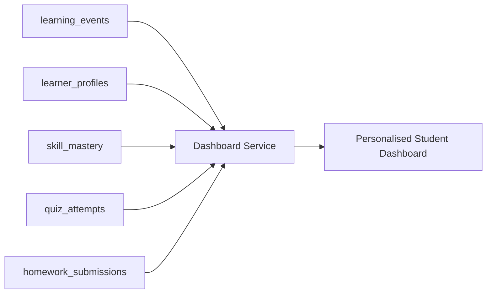

# 13 - Dashboard Data Map Documentation

## Overview

This section traces every card, metric, widget, and chart on the frontend dashboard (`src/pages/Dashboard.jsx`) back to its backend API endpoint, service, and database field.

---

## Dashboard Component Data Source Mapping (Current Implementation)

| UI Element | React Component / Line | API Endpoint | Backend Service | MongoDB Collection & Field | Calculation / Logic | Status |
| :--- | :--- | :--- | :--- | :--- | :--- | :--- |
| **Welcome Banner** | `Dashboard.jsx:L154` | `GET /dashboard/` | `dashboard.py:L11` | `users.full_name` | `f"Welcome back, {full_name}"` | `Partially Implemented` |
| **Mental Age Card** | `Dashboard.jsx:L157-L166` | `GET /dashboard/` | `dashboard.py:L11` | `user_profiles.intellectual_level` | Direct retrieval | `Partially Implemented` |
| **Quizzes Completed** | `Dashboard.jsx:L170-L175` | `GET /dashboard/` | `dashboard.py:L11` | Expected `quiz_stats.completed_quizzes` | `MISSING` in backend response contract | `CONTRACT MISMATCH` |
| **Learning Streak** | `Dashboard.jsx:L176-L180` | `GET /dashboard/` | `dashboard.py:L11` | Expected `learning_streak` | `MISSING` in backend response contract | `CONTRACT MISMATCH` |
| **Average Score** | `Dashboard.jsx:L181-L185` | `GET /dashboard/` | `dashboard.py:L11` | Expected `quiz_stats.average_score` | `MISSING` in backend response contract | `CONTRACT MISMATCH` |
| **Homework Done** | `Dashboard.jsx:L186-L190` | `GET /dashboard/` | `dashboard.py:L11` | Expected `homework_stats.completed_homework` | `MISSING` in backend response contract | `CONTRACT MISMATCH` |
| **Badges Earned** | `Dashboard.jsx:L191-L195` | `GET /dashboard/` | `dashboard.py:L11` | Expected `badges_earned` | `MISSING` in backend response contract | `CONTRACT MISMATCH` |
| **Recent Activity List**| `Dashboard.jsx:L337-L367` | `GET /dashboard/recent-activity` | `dashboard.py:L263` | `user_activity` collection | `user_activity.find().sort("timestamp", -1)` | `UNPOPULATED` (Collection is never written to) |
| **Weekly Stats** | `Dashboard.jsx:L70` | `GET /dashboard/stats/weekly` | `dashboard.py:L294` | `user_activity` collection | Group by `timestamp` day | `UNPOPULATED` (Collection is never written to) |

---

## Technical Audit Findings (Current Implementation)

1. **Schema & API Contract Disconnect**:
   - `schemas.py` defines a complete `DashboardInfo` model containing `quiz_stats`, `learning_streak`, `homework_stats`, `badges_earned`, and `recent_activities`.
   - However, `dashboard.py:get_dashboard_overview` returns a completely different dict containing `stats.total_courses`, `completed_courses`, `in_progress`, `completion_rate`.
   - As a result, the frontend renders `0` for Quizzes Completed, Learning Streak, Average Score, Homework Done, and Badges Earned. [schemas.py:L162-L173](file:///home/manika/Documents/Projects/Learning-Platform/learning-potato/ai-learning-backend/app/schemas.py#L162-L173), [dashboard.py:L27-L50](file:///home/manika/Documents/Projects/Learning-Platform/learning-potato/ai-learning-backend/app/router/dashboard.py#L27-L50)

---

## Target Rebuild Dashboard Data Architecture `TARGET REBUILD DESIGN`

In the rebuilt platform, dashboard metrics will be dynamically computed from the student's **Learner Profile** and **Learning Event Stream**:

### Data Sources for Target Dashboard
- **Learner Profile Summary**: Visualizes cognitive and academic dimension levels (e.g., Comprehension Level, Problem Solving, Reading Level).
- **Skill Mastery Matrix**: Shows granular topic progress derived from `skill_mastery` collection.
- **Quiz Performance Metrics**: Completed count, average score, and recent score trendlines aggregated from `quiz_attempts`.
- **Homework Activity**: Submitted count, completion rate, and topic distribution derived from `homework_submissions`.
- **Learning Events Timeline**: Chronological event feed (points, badges, milestones) driven by `learning_events`.
- **Adaptive Recommendations**: Real-time next actions suggested by the Adaptation Policy Engine based on ongoing student telemetry.
