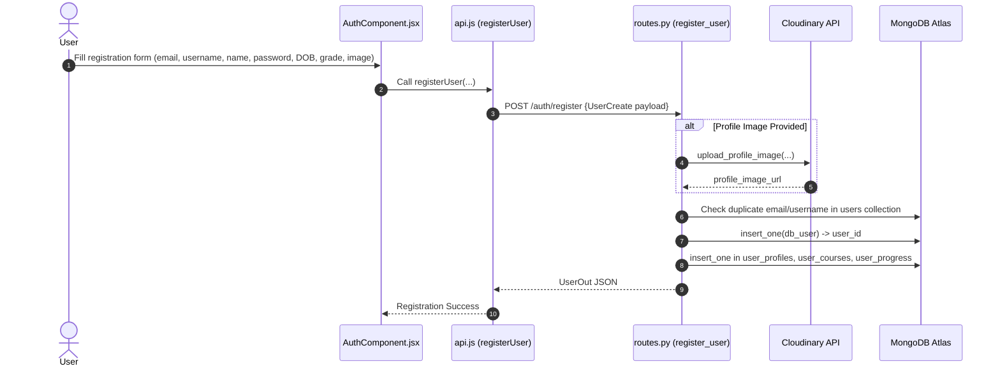
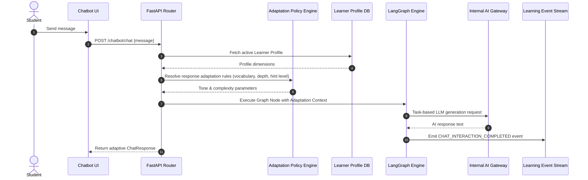

# 19 - Current & Target User Workflows Documentation

## Overview

This document maps both the audited current-system workflows and the target V1 student workflows designed for the rebuild.

---

## 1. Audited Current Workflows (Current Implementation)

### 1.1 User Registration Workflow

### 1.2 User Login Workflow
1. User enters email and password into `AuthComponent.jsx`.
2. `AuthComponent.jsx` calls `loginUser(email, password)` in `src/api/api.js`.
3. `loginUser` sends `POST /auth/login` to backend.
4. Backend verifies email exists in `users` collection and checks password hash via `verify_password`.
5. Backend sets `access_token` JWT cookie (`HttpOnly`).
6. `loginUser` in `api.js` attempts to store token in `localStorage.setItem('access_token', response.access_token)`. (Known Bug: stores `"undefined"`).
7. `AuthComponent.jsx` redirects user to `/dashboard`.

---

## 2. Target V1 Workflows `TARGET REBUILD DESIGN`

### 2.1 Student Registration Workflow
1. Student registers on frontend (`email`, `username`, `full_name`, `password`, `grade_level`).
2. API validates schema and creates document in `users` collection with `role: "student"`.
3. API creates initial document in `student_profiles` collection.
4. JWT token returned to student and stored securely.

### 2.2 Student Login Workflow
1. Student authenticates via `POST /auth/login`.
2. JWT bearer token issued and saved in frontend auth store.
3. Student redirected to Personalised Dashboard.

### 2.3 Initial Learner Assessment Workflow
1. New student is presented with an initial diagnostic assessment.
2. Student submits responses to diagnostic questions.
3. System logs `ASSESSMENT_ANSWERED` telemetry events.
4. Assessment engine evaluates answers across cognitive and academic dimensions.

### 2.4 Learner Profile Creation Workflow
1. Diagnostic evaluation results populate the student's `LearnerProfile` document in `learner_profiles`.
2. Initial skill mastery levels set in `skill_mastery` collection.
3. Initial recommendations and roadmap generated.

### 2.5 Adaptive Chatbot Interaction Workflow

### 2.6 Adaptive Quiz Generation Workflow
1. Student requests a quiz on a topic.
2. Quiz Service queries Adaptation Engine for current skill mastery and target difficulty.
3. AI Gateway generates customized questions matching student's comprehension and reading level.
4. Quiz definition saved to `quiz_definitions`.

### 2.7 Adaptive Homework Assistance Workflow
1. Student uploads homework image.
2. OCR engine extracts problem text.
3. Adaptation Engine determines scaffolding depth based on student's topic mastery.
4. AI Gateway generates step-by-step hints and explanations.

### 2.8 Learning Event Creation Workflow
1. Any completed interaction (quiz attempt, chat turn, homework submission) creates a `LearningEvent` record in `learning_events`.

### 2.9 Dashboard Personalisation Workflow
1. Dashboard service queries `learner_profiles`, `skill_mastery`, and recent `learning_events`.
2. Adaptation Engine ranks personalized next steps and progress charts.
3. Tailored metrics rendered on Student Dashboard.

### 2.10 Roadmap Recalculation Workflow
1. As new `LearningEvents` are ingested, Recalibration Engine updates `skill_mastery`.
2. Topic progression order and review intervals recalculated in `roadmaps` collection.
