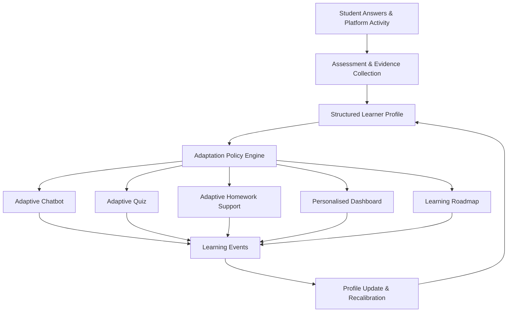

# 22 - Confirmed Product Decisions

## Overview

This document records the authoritative product decisions confirmed by the product owner following the initial audit. These decisions define the target scope, architectural recommendations, and deferred requirements for the upcoming platform rebuild.

> [!NOTE]
> **Audit Integrity Notice**: The initial codebase audit findings in documents `00` through `21` represent verified empirical facts of the current implementation. This document (`22`) records product decisions and target architecture requirements for V1 without altering the historical audit findings of the pre-rebuild codebase.

---

## Decision 1 — Initial User Scope (Student-Only Platform)

### Decision
The initial rebuild (V1) of the platform will support **students only**. 
- Parent, guardian, educator, mentor, administrator, or moderator portals are **out of scope** for V1.
- Multi-role dashboards, guardian-child relationships, educator course-management workflows, and admin portals will **not** be implemented in V1.

### Reason
Focusing exclusively on the core learner experience simplifies V1 execution and allows maximum effort to be dedicated to adaptive learning capabilities.

### Current System Impact
The current codebase has only a single user model without role flags or permission scoping. This matches the V1 single-role requirement.

### Rebuild Impact
- Define a `student` role/account type for V1.
- Design reusable authorization and resource ownership policies (e.g. `student owns session/profile`) so the architecture can support additional roles later without hardcoding single-role assumptions.
- Avoid premature implementation of unused roles in database schemas or UI elements.

```text
Current V1 Requirement: Student only
Future Architectural Capability: Additional roles (Parent, Educator, Admin) may be introduced later
```

---

## Decision 2 — Definition of Platform-Wide Adaptive Learning

### Decision
Adaptive learning is defined as:
> The system begins by evaluating the student through their answers, infers their mental and cognitive capabilities, and adapts the complete platform according to that learner profile.

Adaptivity is **not** limited to chatbot response tone. The target implementation must adapt:
- Chatbot responses (vocabulary, explanation depth, response length, number of steps, hint depth)
- Question difficulty & quiz generation
- Homework helper support & scaffolding
- Dashboard metrics & recommendations
- Personalised learning roadmap & learning pace
- Repetition, revision, and future content selection

### Reason
A truly adaptive platform requires a unified, multidimensional representation of the student rather than isolated prompt tweaks.

### Current System Impact
The existing "mental age" evaluation in `agent_chatbot.py` is documented as an early prototype signal. It only performs basic prompt tuning using an estimated age category and does not adapt the broader platform.

### Rebuild Impact
Replace the single inferred "mental age" integer with a structured, multidimensional **Learner Profile** containing:
1. **Cognitive Dimensions**: Comprehension, logical reasoning, problem solving, memory/recall, attention consistency, processing speed, abstraction ability, multi-step instruction following.
2. **Academic Dimensions**: Reading level, numeracy level, subject familiarity, topic mastery, strengths, weaknesses, misconceptions, assessment history.
3. **Interaction Dimensions**: Preferred explanation depth, response length, visual vs text preference, confidence, learning pace, help-seeking behavior, response engagement.

```text
Current Implementation:
Basic age-based prompt adaptation (Prototype signal).

Target Implementation:
Multidimensional learner profile controlling the complete platform experience.
```

---

## Decision 3 — Moderation Scope (Deferred)

### Decision
Moderation, child-safety classification, human escalation, and guardian notification workflows are **deferred** from the initial rebuild (V1).

### Reason
Focusing on core learning infrastructure for V1 while establishing architectural policy extension points.

### Current System Impact
The initial audit identified critical safety gaps (safety reliant solely on system prompt text, no input/output moderation, no prompt injection defense, no PII protection). These findings remain valid risks.

### Rebuild Impact
- Architect policy extension boundaries into the request lifecycle:
  `Input Policy Layer` → `LangGraph / AI Workflow` → `Output Policy Layer`
- In V1, these policy layers may pass content through unchanged.
- Full moderation remains a mandatory requirement before unrestricted public production release.

```text
V1 Status: Deferred from initial rebuild (Placeholder extension points designed)
Production Status: Mandatory requirement before unrestricted public release
```

---

## Decision 4 — AI Provider Strategy (Task-Based Selection via AI Gateway)

### Decision
No single permanent AI provider is locked for the platform. The rebuild architecture will select AI providers based on task requirements and efficiency.

### Reason
Decoupling application code from specific provider SDKs allows flexibility, cost optimization, and fallback resiliency across different AI workloads (e.g. fast chat vs deep reasoning vs image OCR).

### Current System Impact
The current codebase has fragmented integrations: Groq is called directly via `httpx` in `helper.py` and `groq.py`, `ChatGroq` is used in `llm.py`, `GEMINI_API_KEY` is loaded but unused, and the rate limiter catches OpenAI exceptions instead of Groq exceptions.

### Rebuild Impact
Implement an internal, provider-independent **AI Gateway** abstraction:

```python
class LLMProvider:
    async def generate(
        self,
        messages: list,
        model: str,
        temperature: float = 0.7,
        response_schema: dict = None,
    ):
        ...
```

Concrete provider adapters (e.g. `GroqProvider`, `GeminiProvider`, `OpenAIProvider`) will plug into this gateway. Feature services (Chatbot, Quiz, Homework, Profile Summarizer) will invoke the AI Gateway rather than direct SDKs.

```text
Feature Service  -->  Internal AI Gateway  -->  Configured Provider Adapter  -->  External AI Provider
```

---

## Decision 5 — Database Persistence Strategy (MongoDB Recommended)

### Decision
Most application data will be stored in the primary database. **MongoDB** remains the recommended primary database for the V1 rebuild as it aligns with the document-oriented nature of graph states, chat histories, and learner profiles.

### Reason
MongoDB is already the active database driver in the current codebase (Motor async driver), and its schema-flexible JSON document model naturally supports evolving learner profiles and event streams.

### Current System Impact
The current database setup has defects (SQLAlchemy/Motor conflict, hardcoded connection strings, `user_id` type mismatches between `ObjectId` and `string`, collection name typos like `chat_collection` vs `chat_sessions`).

### Rebuild Impact
Standardize on a clean, repository-pattern MongoDB data layer with a unified schema model:

```text
TARGET DATA MODEL COLLECTIONS:
- users
- student_profiles
- learner_profiles
- assessment_sessions
- assessment_answers
- chat_sessions
- chat_messages
- learning_events
- skill_mastery
- quiz_definitions
- quiz_attempts
- homework_submissions
- recommendations
- roadmaps
- activity_logs
```

---

## Target Adaptive Data Flow Architecture



---

## Summary of Initial Rebuild Scope vs Deferred Scope

### In Scope for V1 Rebuild
- Student authentication & profile ownership
- Student initial cognitive/academic assessment
- Structured multidimensional Learner Profile
- Adaptation Policy Engine
- Adaptive Chatbot (LangGraph + AI Gateway)
- Adaptive Quiz Generator
- Adaptive Homework Helper
- Personalised Student Dashboard
- Learning Roadmap
- MongoDB repository layer & Learning Event model
- Task-based AI Provider Gateway & adapters
- Automated test suite (Pytest & Vitest)

### Architected for Extension, Deferred Implementation
- Input/Output Moderation & Policy Layers
- Safety incident & crisis escalation workflows
- Parent / Guardian Portal & controls
- Educator / Mentor Portal & course management
- Admin Portal & platform monitoring
- Human-in-the-loop review queue

### Explicitly Out of Scope
- Multi-role UI switches
- Payment processing
- Unrestricted public production deployment
