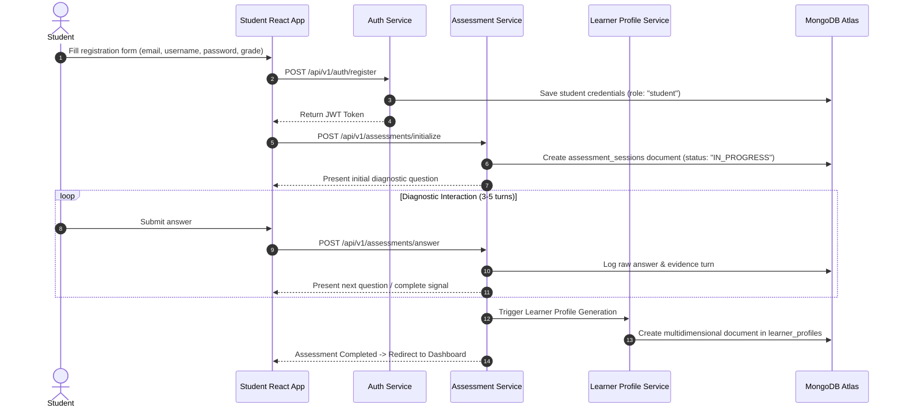
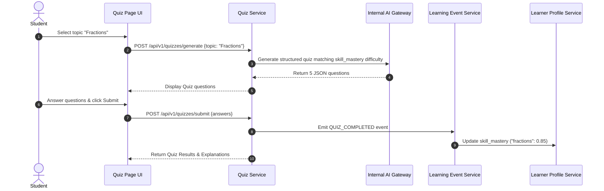

# 05 - User Journeys & End-to-End Workflows

## Overview

This document details the primary end-to-end student user journeys for V1.

---

## Journey UJ-01: Onboarding, Assessment & Initial Profile Setup

---

## Journey UJ-02: Adaptive AI Tutoring Chat Session

1. Student navigates to `/chatbot` tab.
2. App sends `POST /api/v1/chat/initialize`. Backend retrieves active `LearnerProfile` from `learner_profiles`.
3. Adaptation Policy Engine resolves current prompt configuration (`vocabulary_level: "simple"`, `explanation_depth: "guided"`).
4. Student sends question: *"Why is the sky blue?"*
5. Chatbot Service invokes LangGraph workflow; nodes request LLM text via internal `AI Gateway`.
6. AI Gateway dispatches request to configured provider adapter (e.g. `GroqProvider` or `GeminiProvider`).
7. Response is returned to student UI; `CHAT_INTERACTION_COMPLETED` telemetry event is logged.

---

## Journey UJ-03: Homework Helper Step-by-Step Scaffolding

1. Student navigates to `/HomeWorkHelper` and uploads photo of math homework.
2. App sends `POST /api/v1/homework/upload` with multipart image payload.
3. Homework Service passes image bytes to OCR engine (`tesseract` / vision API).
4. Extracted text is analyzed by Adaptation Engine alongside student's `reading_level` and `instruction_following` metrics.
5. Service returns micro-step 1: *"First, let's identify the numbers in the equation."*
6. `HOMEWORK_PROCESSED` event logged to `learning_events`.

---

## Journey UJ-04: Adaptive Quiz Challenge & Mastery Feedback

