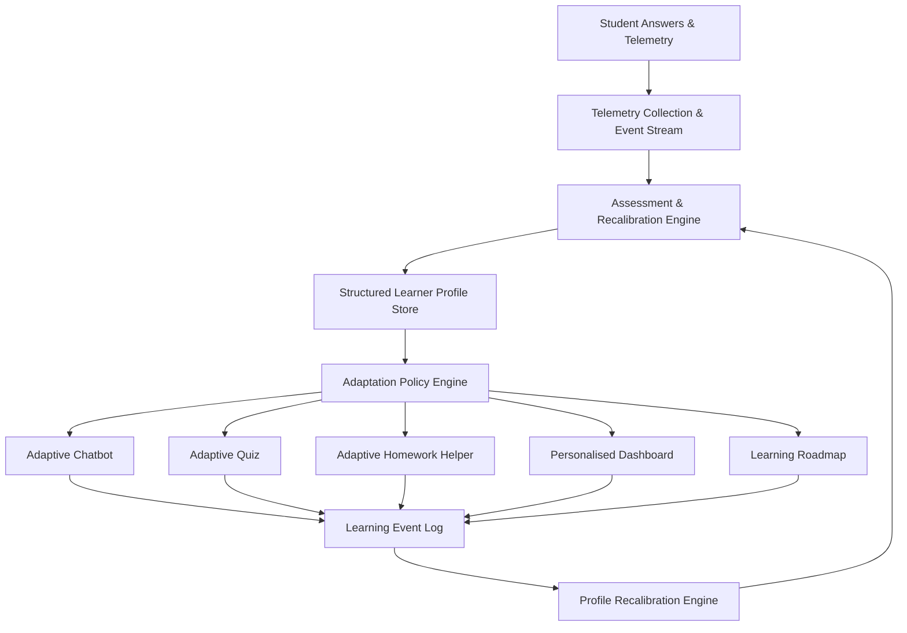

# 06 - Adaptive Learning Specification

## Overview

This specification details the end-to-end framework for platform-wide adaptivity.

> [!CONFIRMED]
> **Confirmed Product Definition**: Adaptive learning is defined as evaluating the student through their answers and interactions, building a structured multidimensional representation of their mental, cognitive, academic, and interaction capabilities, and adapting the complete platform accordingly.

---

## Target Adaptive Feedback Loop Architecture

---

## Initial vs Continuous Adaptation Rules

1. **Initial Adaptation**:
   - Established during the initial diagnostic assessment.
   - Sets baseline cognitive levels (`comprehension`, `reasoning`), initial academic grade estimates (`reading_level`, `numeracy_level`), and interaction defaults (`explanation_depth: "guided"`).

2. **Continuous Adaptation**:
   - Triggered asynchronously by `LearningEvents` generated during student activity.
   - Adjusts specific skill mastery scores (`skill_mastery`), updates trouble spots (`weaknesses`, `misconceptions`), and fine-tunes preferred response lengths.

---

## Safeguards Against Overreaction & Evidence Confidence

To prevent the platform from drastically shifting difficulty due to a single accidental mistake or slow internet connection:

- **Evidence Confidence Factor**: Every profile dimension field includes a `confidence` metric (float `0.0` to `1.0`) and an `evidence_count` integer.
- **Minimum Evidence Threshold**: Major adaptation changes (e.g. advancing a reading level or changing quiz difficulty tier) require a minimum threshold of `5` independent learning evidence events.
- **Dampened Recalibration**: Profile scores use moving averages rather than instant overwrites. Single anomalous answers adjust confidence slightly without immediately altering adaptation policies.
