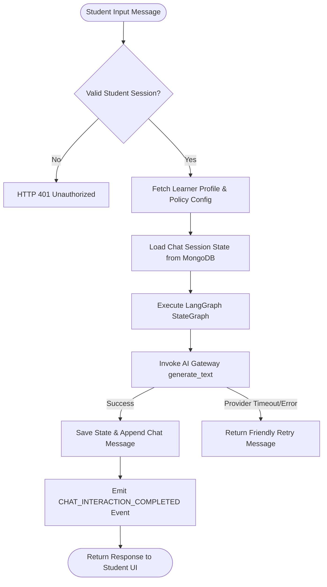

# 10 - Chatbot Specification

## Overview

The V1 Tutoring Chatbot is powered by a refactored **LangGraph** `StateGraph` agent that integrates with the internal **AI Gateway** and consumes configuration parameters from the **Adaptation Policy Engine**.

---

## State Schema Specification (`TARGET V1 STATE`)

```python
from typing import TypedDict, List, Optional

class TargetChatState(TypedDict):
    # Identity & Session
    user_id: str
    session_id: str
    schema_version: int

    # Adaptation Context (Injected from Adaptation Policy Engine)
    vocabulary_complexity: str  # "SIMPLE", "MODERATE", "ADVANCED"
    explanation_depth: str      # "CONCISE", "GUIDED", "DETAILED"
    include_analogies: bool
    max_sentences: int

    # Conversation History
    conversation_history: List[dict]  # [{"role": "user"/"assistant", "content": "..."}]
    user_input: str
    current_response: Optional[str]

    # Graph Execution Control
    graph_step_count: int
    max_steps_allowed: int
    error_state: Optional[str]
```

---

## Session Lifecycle & Failure Recovery



---

## Target LangGraph Graph Requirements

1. **Modular Node Files**: Node logic is isolated into dedicated files (`app/domains/chatbot/nodes/tutoring.py`, `app/domains/chatbot/nodes/assessment.py`).
2. **AI Gateway Integration**: Nodes invoke `AI Gateway` rather than direct `ChatGroq` or OpenAI SDKs.
3. **Async MongoDB Checkpointer**: Replaces in-memory checkpointer with `AsyncMongoDBSaver` using `chat_sessions` collection.
4. **Step Counter**: Enforces `max_steps_allowed = 10` to prevent infinite loops.
