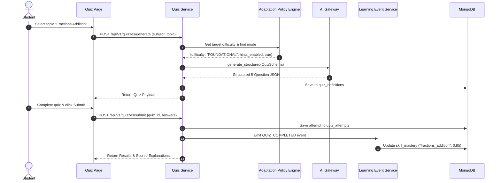

# 11 - Quiz Specification

## Overview

The V1 Quiz Service dynamically generates adaptive practice quizzes matching the student's topic mastery and adaptation policy configuration.

---

## Quiz Generation & Submission Lifecycle



---

## Structured Quiz Schema (`TARGET V1`)

```json
{
  "quiz_id": "qz_123456789",
  "subject": "mathematics",
  "topic": "fractions_addition",
  "difficulty": "FOUNDATIONAL",
  "questions": [
    {
      "question_id": "q1",
      "question_text": "What is 1/4 + 2/4?",
      "options": ["1/4", "2/4", "3/4", "4/4"],
      "correct_option_index": 2,
      "hint": "Since the bottom numbers (denominators) are the same, just add the top numbers!",
      "explanation": "1 + 2 = 3, so 1/4 + 2/4 = 3/4."
    }
  ]
}
```

---

## Mastery Update & Retry Rules

1. **Mastery Increment**: A quiz score ≥ 80% increments topic mastery by `+0.15` (max `1.0`).
2. **Mastery Decrement & Misconceptions**: A score < 50% decrements topic mastery and flags incorrect answer patterns as potential misconceptions.
3. **Retry Scaffolding**: Failed quizzes generate a revision recommendation with hints enabled before allowing re-attempt.
