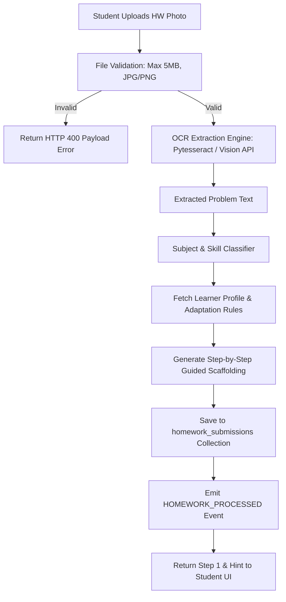

# 12 - Homework Helper Specification

## Overview

The **Homework Helper Service** processes student homework image uploads, performs OCR text extraction, detects the problem domain, and delivers adaptive step-by-step guidance without revealing direct answers immediately.

---

## Image Processing & Scaffolding Pipeline

---

## Technical Specifications & System Dependencies

1. **File Validation**: Restricts uploads to `.jpg`, `.jpeg`, `.png` format under `5 MB`. Client compresses images before transmission to minimize data package costs for underprivileged students.
2. **OCR Engine Requirement**: System invokes `pytesseract` or vision model API. Docker container must include binary OCR installation.
3. **Scaffolding Mode ("Hint-First")**: Instead of outputting the final answer directly, the system outputs:
   - **Extracted Text**: Verified text from the image.
   - **Prerequisite Concept**: Brief explanation of the core concept.
   - **Step 1 Hint**: First action the student should take.
   - **Ask-for-Next-Step Prompt**: Encourages active problem solving.
