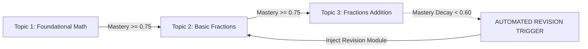

# 14 - Roadmap & Recommendations Specification

## Overview

The **Learning Roadmap Service** manages the student's personalized topic sequence, scheduling new learning modules, prerequisite reviews, and automated revision triggers when skill decay is detected.

---

## Roadmap Progression Logic



---

## Target Recommendation Item Schema (`TARGET V1`)

```json
{
  "recommendation_id": "rec_987654321",
  "user_id": "60c72b2f9b1d8b2a3c4d5e6f",
  "type": "PRACTICE_QUIZ",
  "subject": "mathematics",
  "skill": "fractions_addition",
  "title": "Practice Fractions Addition",
  "description": "Boost your score with a quick 5-question quiz!",
  "priority_score": 0.92,
  "reason": "Skill mastery is at 55%. Practicing now will unlock Advanced Fractions.",
  "status": "ACTIVE",
  "created_at": "2026-08-03T01:00:00Z"
}
```

---

## Recalculation Triggers & Revision Scheduling

1. **Recalculation Triggers**: The roadmap updates after:
   - Initial assessment completion.
   - Every 3 completed quizzes.
   - Skill mastery decay below `0.60`.
2. **Student-Facing Explanation**: Recommendations always include a transparent `reason` string explaining *why* the topic is recommended, reinforcing student motivation.
