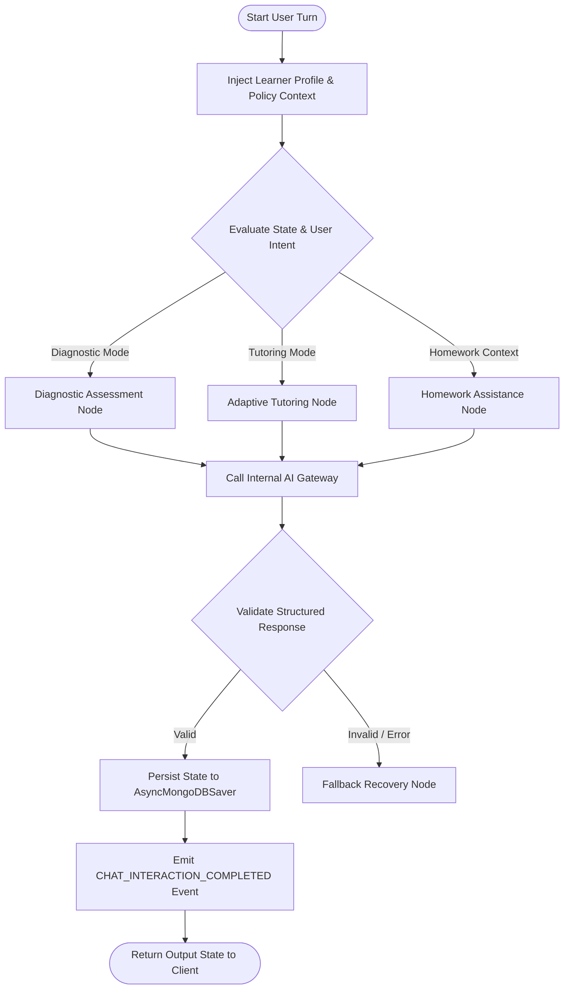

# 18 - LangGraph Target Architecture

## Overview

The target LangGraph architecture refactors the existing monolithic `agent_chatbot.py` script into modular node packages while replacing in-memory compiling with async MongoDB checkpointers.

---

## Target StateGraph Diagram

---

## Core Refactoring Directives for LangGraph System

1. **Modular Node Structure**: Move nodes out of `agent_chatbot.py` into `app/domains/chatbot/nodes/`.
2. **Internal AI Gateway Invocation**: Replace direct `ChatGroq` or `ChatOpenAI` instantiations inside nodes with `AI Gateway` calls (`ai_gateway.generate_text(...)` / `generate_structured(...)`).
3. **Pydantic Response Parsing**: Use structured output models (`with_structured_output(...)`) to replace brittle regex string parsing.
4. **Async Mongo Checkpointer**: Replace `MemorySaver` with custom `AsyncMongoDBSaver` storing graph state in `chat_sessions`.
5. **Decoupled Business Logic**: Graph nodes remain focused strictly on conversation state routing and prompt construction. Profile recalibration and telemetry logging are handled outside the graph execution loop via `LearningEvent` listeners.
