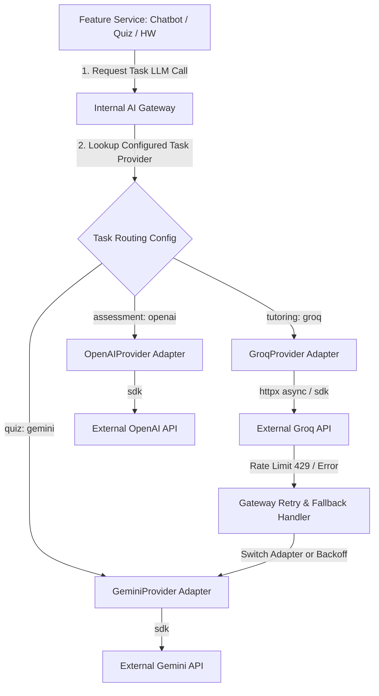

# 19 - AI Gateway Architecture

## Overview

The **AI Gateway** is an internal, provider-independent abstraction layer (`integrations/ai/gateway.py`) that handles all interaction between application domain services and external third-party LLM providers (e.g. Groq, Gemini, OpenAI).

---

## Provider Abstract Interface Definition (`TARGET V1`)

```python
from abc import ABC, abstractmethod
from typing import List, Dict, Any, Optional
from pydantic import BaseModel

class LLMProvider(ABC):
    """Abstract interface required for all external AI provider adapters."""

    @abstractmethod
    async def generate_text(
        self,
        messages: List[Dict[str, str]],
        model: str,
        temperature: float = 0.7,
        max_tokens: Optional[int] = None,
        timeout_seconds: int = 30,
    ) -> str:
        pass

    @abstractmethod
    async def generate_structured(
        self,
        messages: List[Dict[str, str]],
        model: str,
        response_schema: type[BaseModel],
        temperature: float = 0.2,
        timeout_seconds: int = 30,
    ) -> BaseModel:
        pass
```

---

## AI Gateway Task Routing & Adapter Architecture



---

## Gateway Responsibilities

1. **Provider Isolation**: Feature code never imports `groq`, `google.generativeai`, or `openai` directly.
2. **Error Translation & Retry**: Intercepts 429 rate limit exceptions across all providers, executing exponential backoff or switching to a secondary backup adapter.
3. **Pydantic Validation**: Validates structured output JSON against Pydantic schemas before returning results to business services.
4. **Telemetry & Token Tracking**: Logs prompt tokens, completion tokens, latency, and provider name without exposing sensitive child PII in logs.
