# 22 - Authentication & Data Ownership Specification

## Overview

This specification details the authentication scheme and resource ownership validation rules enforcing student data isolation in V1.

---

## Token Authentication & Ownership Flow

```mermaid
sequenceDiagram
    autonumber
    actor Student UI
    participant Middleware as Auth Middleware
    participant Route as Protected Route
    participant DB as MongoDB Repository

    Student UI->>Middleware: API Request with Header `Authorization: Bearer <JWT>`
    Middleware->>Middleware: Decode JWT & verify HS256 signature
    alt Invalid / Expired Token
        Middleware-->>Student UI: HTTP 401 Unauthorized
    end
    Middleware->>Route: Pass current_student context (user_id: ObjectId("..."), role: "student")

    Route->>DB: Query requested resource (e.g. chat_session_id)
    DB-->>Route: Resource Document (user_id: ObjectId("..."))
    
    Route->>Route: Verify resource.user_id == current_student.user_id
    alt Ownership Mismatch
        Route-->>Student UI: HTTP 403 Forbidden ("You do not own this resource")
    end
    Route-->>Student UI: Return Resource Payload
```

---

## Resource Ownership Matrix (`TARGET V1`)

| Collection / Resource | Ownership Field | Validation Rule | Enforcement Layer |
| :--- | :--- | :--- | :--- |
| `student_profiles` | `user_id` | Must equal `current_student.user_id` | Backend Route / Dependency |
| `learner_profiles` | `user_id` | Must equal `current_student.user_id` | Backend Route / Dependency |
| `chat_sessions` | `user_id` | Must equal `current_student.user_id` | Chat Service |
| `quiz_attempts` | `user_id` | Must equal `current_student.user_id` | Quiz Service |
| `homework_submissions` | `user_id` | Must equal `current_student.user_id` | Homework Service |
| `learning_events` | `user_id` | Must equal `current_student.user_id` | Telemetry Service |
| `roadmaps` | `user_id` | Must equal `current_student.user_id` | Roadmap Service |

---

## Role-Ready Architecture Rule

Accounts store `role: "student"`. Although V1 is student-only, permission checks evaluate `require_role("student")` via FastAPI dependencies rather than assuming global single-user access. This ensures that when Parent, Educator, or Admin roles are introduced in future releases, core authorization dependencies can be extended without refactoring route logic.
