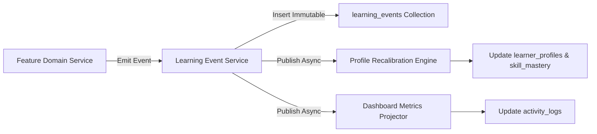

# 23 - Learning Event Model

## Overview

The **Learning Event Model** defines the immutable telemetry stream used for student activity logging, dashboard metrics projection, and Learner Profile recalibration.

---

## Shared Event JSON Schema (`TARGET V1 SCHEMA`)

```json
{
  "$schema": "https://json-schema.org/draft/2020-12/schema",
  "title": "LearningEvent",
  "type": "object",
  "required": [
    "event_id",
    "user_id",
    "event_type",
    "source",
    "payload",
    "schema_version",
    "occurred_at",
    "recorded_at"
  ],
  "properties": {
    "event_id": { "type": "string", "description": "Unique string ID (evt_...)" },
    "user_id": { "type": "string", "description": "BSON ObjectId reference to users collection" },
    "event_type": {
      "type": "string",
      "enum": [
        "ASSESSMENT_STARTED",
        "ASSESSMENT_ANSWERED",
        "ASSESSMENT_COMPLETED",
        "CHAT_MESSAGE_SENT",
        "CHAT_INTERACTION_COMPLETED",
        "QUIZ_STARTED",
        "QUIZ_COMPLETED",
        "HOMEWORK_SUBMITTED",
        "HOMEWORK_PROCESSED",
        "PROFILE_UPDATED",
        "SKILL_MASTERY_UPDATED",
        "RECOMMENDATION_CREATED",
        "ROADMAP_UPDATED"
      ]
    },
    "source": { "type": "string", "enum": ["assessment", "chatbot", "quiz", "homework", "dashboard", "roadmap"] },
    "subject": { "type": ["string", "null"] },
    "skill": { "type": ["string", "null"] },
    "payload": { "type": "object", "additionalProperties": true },
    "schema_version": { "type": "integer", "default": 1 },
    "occurred_at": { "type": "string", "format": "date-time" },
    "recorded_at": { "type": "string", "format": "date-time" }
  }
}
```

---

## Event Processing & Telemetry Flow


